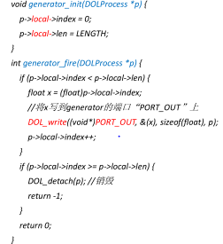
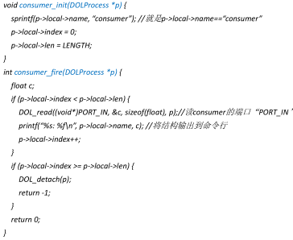
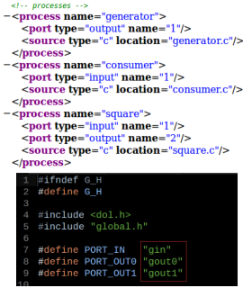
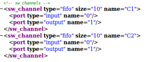
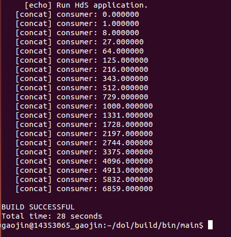
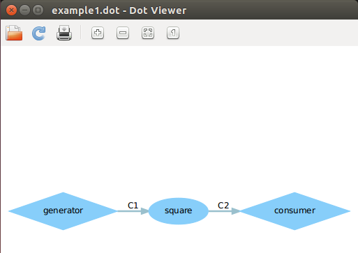
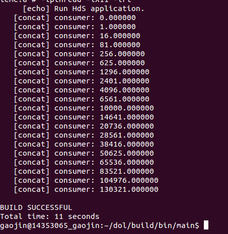
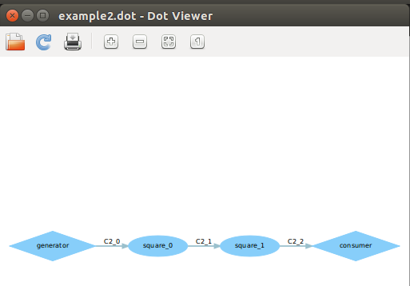

#DOL 实例分析&编程
###实验任务
* 修改example2，让3个square模块变成2个, tips:修改xml的iterator
* 修改example1，使其输出3次方数，tips:修改square.c

###实验了解
####对example1代码分析：
1. generator.c 代码
  * 定义进程：每个模块都要写上xxx_fire（可能被执行无
数次），至于init是可选择写或者不写的，xxx_init（只
会被执行一次）。
  * generator_init 是初始化函数。这里代码的意思是将当前
位置置为0，设置生产者长度。这里的local指针指向的
是.h文件的_local_states结构。
  *  generator_fire 是信号产生函数。这里的代码是：如果
当前位置小于生产长度，则将x（这里是当前下标）写
入到输出端，否则销毁进程。所以说就是，让这个程序
被发射、开火、执行length次之后停下来。

       

2. consumer.c 代码
  * 定义消费者进程
  * consumer_init初始化函数，含义同
generator_init。
  * consumer_fire信号消费函数，若当前位置小
于设定长度，则读出输入端信号，并且打印；
否则销毁进程（停下来）。

    

3. square.c 部分代码
  *  定义平方进程
  *   square_fire信号处理函数，读入输入端信号i，将其平
方后写出到输出端，也是重复length次之后就停止了。

    
4. ./examples/example1/example1.xml文件
  * 进程定义: 
  
			process name=“未知数1"

			port type=“未知数2” name=“未知数3” (有几个端口就要有几行这个)

			source type=“c” location=“未知数1.c"(这里就是说有2个端口)

			/process

 *  未知数1==实现的模块的名字，比如写了xxx.c这里就
是xxx了
 * 未知数2==output或者input
 * 未知数3==端口的名字，在*.h的文件里面

		
5. 通道部分代码
  *  通道定义，一条线就是一条通道
  
			sw_channel type=“fifo” size=“未知数1” name=“未知数2"

			port type=“input” name=“in"

			port type=“output” name=“out"（两个端口，一个叫”in”，一个叫”out”）

			/sw_channel

####对example2代码分析
*  各进程功能定义与example1相同，不同之处在于example2架构中中包含3个
square进程，故结果为 i^8

### 实验步骤
####对example1进行更改
* 根据上面example1的分析我们知道在square.c中的i* i 定义了平方的运算，p->local->index是指当前的位置，该值被初始化为0；p->local->len为生产者的长度，若满足当前位置小于生产者的长度，则对变量i进行平方运算。若想输出3次方，那么就把i* i 更改为 i* i*i。

		if (p->local->index < p->local->len) {
		//  读 square 的端口“ PORT_IN ” , 将值读到 i
		DOL_read((void*)PORT_IN, &i, sizeof(float), p);
		i = i*i*i; // 改为立方
		//  写 square 的端口“ PORT_OUT ” , 把 I  写到那个端口
		DOL_write((void*)PORT_OUT, &i, sizeof(float), p);
		p->local->index++;
		}
####对example2进行更改
* 在example2.xml中我们可以看到如下语句：

		variable value="3" name="N"

   可以看到在源代码中定义了三个square模块，同时每个模块的连接可以参见example1的分析，如果我们想把模块数更改为2个，只需要把value的值变为2即可：
		
		variable value="2" name="N"
###实验结果
####example1结果
输入cd dol/build/bin/main 然后编译sudo ant –f runexample.xml –Dnumber=1。可以得带如下结果：

由图可以看出此图输出了从1-19的三次方。
然后在build文件夹中找到example1的dot的文件双击打开，如果没有安装相应软件，系统会提醒安装，只要跟着系统点击即可得到的dot图为：

####example2结果
输入cd dol/build/bin/main 然后编译sudo ant –f runexample.xml –Dnumber=2。可以得带如下结果：
 

由图可以看出此图输出了从1-19的四次方。打开dot图为：

###实验感想
这次实验其实不是很难，只要理解了TA上课讲的example的个部分源代码意义及功能，比如example1的更改就是square.c部分的定义平方的进程，所以只要跟着PPT更改就可以了，这次主要遇到的问题就是因为之前实验没有把build文件删掉，导致会出现一些错误，比如build.xml文件不存在。然后在打开dot文件的时候出现了一直不停的出现提示的现象，然后重启虚拟机就可以了。