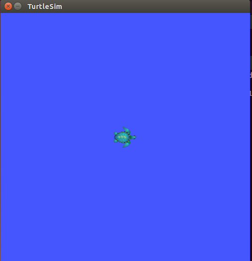
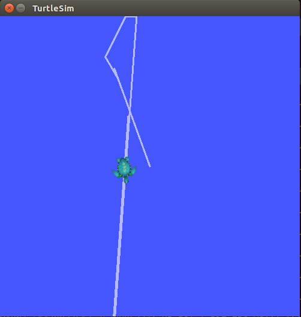
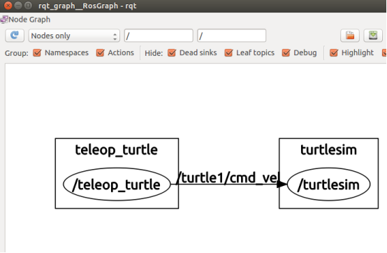

#安装ROS
###安装步骤
* 添加sources.list
			
		sudo sh -c 'echo "deb http://packages.ros.org/ros/ubuntu $(lsb_release -sc) main" > /etc/apt/sources.list.d/ros-latest.list'
* 添加keys
 	
		sudo apt-key adv --keyserver hkp://pool.sks-keyservers.net --recv-key 0xB01FA116
* 安装
 * 首先确保你的Debian软件包索引是最新的：
 				
			sudo apt-get update
 * ROS中有很多各种函数库和工具，推荐安装桌面完整版：
 		
			sudo apt-get install ros-jade-desktop-full

* 初始化 rosdep，在开始使用ROS之前你还需要初始化rosdep。rosdep可以方便在你需要编译某些源码的时候为其安装一些系统依赖，同时也是某些ROS核心功能组件所必需用到的工具。
  				
		sudo rosdep init
		rosdep update
* 环境配置
 * 如果每次打开一个新的终端时ROS环境变量都能够自动配置好（即添加到bash会话中），那将会方便很多：
 			
			echo "source /opt/ros/jade/setup.bash" >> ~/.bashrc
			source ~/.bashrc 

 * 如果你安装有多个ROS版本, ~/.bashrc 必须只能 source 你当前使用版本所对应的 setup.bash。如果你只想改变当前终端下的环境变量，可以执行以下命令：
 
			source /opt/ros/jade/setup.bash
* 安装 rosinstall，rosinstall 是ROS中一个独立分开的常用命令行工具，它可以方便让你通过一条命令就可以给某个ROS软件包下载很多源码树。要在ubuntu上安装这个工具，请运行：

		sudo apt-get install python-rosinstall
 ###安装测试
安装ROS成功之后在Beginner Tutorials有一个简单的测试程序
* 打开第一个终端，输入指令

		roscore
* 打开第二个终端，输入以下指令，开启以下界面：

		rosrun turtlesim turtlesim_node

	
	
* 打开第三个终端，输入一下指令，在这个终端上点击 上下左右按钮控制小乌龟移动。

		rosrun turtlesim turtle_teleop_key

	

* 打开第四个终端，输入以下指令，可以看到ROS nodes以及Topic等图形展示：

		rosrun rqt_graph rqt_graph
	
	

至此为止，测试结束，表示安装成功。